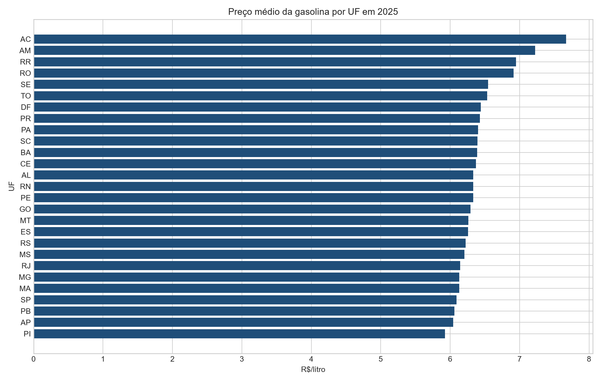
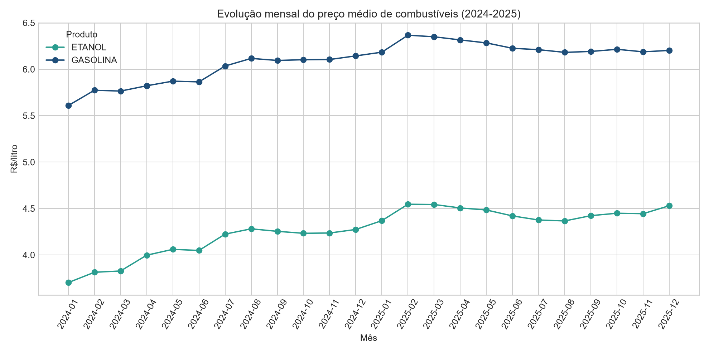

# MVP - Inteligência de preços de gasolina e etanol no Brasil

**Autor:** Bruno Bryto Borges  
**Matrícula:** 231013304  
**Instituição:** Universidade de Brasília - Departamento de Engenharia de Produção

## Resumo executivo

Este MVP constrói um pipeline de dados em nuvem para transformar a série histórica de preços de combustíveis da Agência Nacional do Petróleo, Gás Natural e Biocombustíveis (ANP) em informação útil para consumidores, gestores de frotas e analistas de custos.

Foram processadas 1.712.267 observações brutas dos quatro semestres completos de 2024 e 2025. Após a seleção de gasolina comum e etanol, validação de domínio e deduplicação, a camada analítica contém 820.498 medições válidas, cobrindo as 27 unidades da Federação e 461 municípios.

Principais achados:

- em 2025, os maiores preços médios da gasolina foram observados no Acre (R$ 7,671/l), Amazonas (R$ 7,226/l) e Roraima (R$ 6,948/l); os menores foram Piauí (R$ 5,925/l), Amapá (R$ 6,042/l) e Paraíba (R$ 6,059/l);
- entre janeiro de 2024 e dezembro de 2025, a média nacional da gasolina subiu 10,6%, de R$ 5,609/l para R$ 6,203/l; a do etanol subiu 22,4%, de R$ 3,702/l para R$ 4,530/l;
- considerando a regra prática de competitividade de 70%, o etanol foi competitivo em todos os 24 meses em Mato Grosso, Mato Grosso do Sul e São Paulo;
- a maior dispersão relativa ocorreu no etanol em São Paulo, Distrito Federal, Mato Grosso, Mato Grosso do Sul e Goiás, sugerindo maior benefício potencial da pesquisa de preços nessas localidades.

## 1. Problema e hipótese do MVP

O preço dos combustíveis varia no tempo e entre localidades, afetando orçamento familiar, custo logístico e decisões de abastecimento. O problema é transformar milhões de registros de postos em respostas reproduzíveis sobre nível, tendência, competitividade e dispersão de preços.

**Hipótese:** um pipeline automatizado, com dados públicos persistidos em tabelas Delta, permite identificar diferenças geográficas e temporais relevantes o suficiente para apoiar decisões de abastecimento e planejamento de custos.

### Perguntas de negócio

1. Quais UFs apresentaram os maiores e os menores preços médios da gasolina em 2025?
2. Como os preços médios de gasolina e etanol evoluíram entre janeiro de 2024 e dezembro de 2025?
3. Em quais UFs o etanol foi economicamente competitivo em relação à gasolina, usando a razão de 70% como regra de referência?
4. Em quais combinações de UF e produto houve maior dispersão de preços, indicando maior valor potencial para pesquisa de mercado?
5. Os dados apresentam problemas de completude, unicidade, consistência, conformidade, acurácia ou atualidade capazes de comprometer as respostas?

## 2. Fonte, coleta e licença dos dados

- **Fonte:** [Série Histórica de Preços de Combustíveis e de GLP - ANP](https://www.gov.br/anp/pt-br/centrais-de-conteudo/dados-abertos/serie-historica-de-precos-de-combustiveis)
- **Arquivos:** combustíveis automotivos, 1º e 2º semestres de 2024 e 2025, em ZIP/CSV.
- **Data da coleta deste MVP:** 28/09/2026.
- **Volume original:** 288,9 MB em CSV; 1.712.267 registros.
- **Formato:** CSV UTF-8, delimitado por ponto e vírgula.
- **Licenciamento e reutilização:** a ANP publica a série como dado aberto em cumprimento ao Decreto nº 8.777/2016. A fonte deve ser atribuída e os dados não devem ser apresentados como se fossem produzidos pelo autor deste repositório.
- **Redistribuição:** os arquivos brutos não são versionados no GitHub devido ao volume. O notebook contém as URLs oficiais e reproduz a coleta.
- **Privacidade:** a origem inclui CNPJ e endereço de estabelecimentos, não dados pessoais de consumidores. A camada analítica exclui endereços e substitui o CNPJ por um hash SHA-256.

## 3. Arquitetura e ferramentas

O pipeline foi implementado no Databricks com Python, PySpark, Spark SQL e Delta Lake.

```text
ANP (ZIP/CSV)
    |
    v
Bronze - dados originais + URL, período e horário de ingestão
    |
    v
Silver - tipos corrigidos, domínios validados, CNPJ pseudonimizado e duplicatas removidas
    |
    v
Gold - modelo estrela + tabelas de respostas e qualidade
    |
    v
README, tabelas de resultados e evidências visuais
```

As tabelas Delta usam o prefixo `tarefa_4_` no catálogo e esquema ativos do workspace. A última célula do notebook relê todas as tabelas e apresenta suas contagens, demonstrando persistência na nuvem.

## 4. Modelagem

Foi adotado um esquema estrela:

- `tarefa_4_fato_precos`: uma medição de preço por posto, produto e data;
- `tarefa_4_dim_localidade`: região, UF e município;
- `tarefa_4_dim_produto`: produto e unidade de medida;
- `tarefa_4_dim_tempo`: data, ano, mês e ano-mês;
- `tarefa_4_dim_posto`: identificador pseudonimizado e bandeira.

O [Catálogo de Dados](catalogo/catalogo_dados.md) documenta tipos, domínios, nulabilidade e linhagem. O [diagrama do modelo](catalogo/modelo_estrela.mmd) registra as relações entre fato e dimensões.

## 5. Regras de transformação e carga

1. baixar os quatro ZIPs da página oficial da ANP;
2. extrair e ler os CSVs com esquema explícito;
3. registrar URL, período de origem e horário de ingestão na Bronze;
4. padronizar textos em maiúsculas e remover acentos do nome do produto;
5. converter `Data da Coleta` para data e valores monetários para `double`;
6. selecionar gasolina comum e etanol;
7. pseudonimizar o CNPJ com SHA-256 e excluir endereço e razão social da Silver;
8. marcar como válido apenas preço entre R$ 0,50 e R$ 20,00, data válida e UF com duas letras;
9. remover duplicatas por posto, produto, data e preço;
10. gravar tabelas Delta Bronze, Silver, dimensões, fato, qualidade e resultados Gold.

Todas as escritas usam modo `overwrite` para tornar a execução idempotente: repetir o pipeline atualiza a versão sem duplicar registros.

## 6. Qualidade dos dados

A análise foi aplicada a todos os atributos da camada Silver e está disponível em [`evidencias/qualidade_por_atributo.csv`](evidencias/qualidade_por_atributo.csv).

| Dimensão | Resultado | Tratamento/efeito |
|---|---|---|
| Completude | `valor_compra` está 100% ausente; demais atributos analíticos sem nulos | `valor_compra` foi mantido para evidenciar a limitação, mas não é usado nas respostas |
| Unicidade | 4 duplicatas exatas entre 820.502 registros selecionados | removidas por chave composta da medição |
| Consistência | 27 UFs, 5 regiões e unidade única `R$ / LITRO` | regras explícitas na Silver |
| Conformidade | 0 preços de venda fora da faixa R$ 0,50-R$ 20,00 | registros fora do domínio seriam marcados inválidos |
| Acurácia | valores entre R$ 2,63 e R$ 9,29/l são plausíveis para o período | inspeção de extremos e estatísticas por atributo |
| Atualidade | janela completa de 01/01/2024 a 31/12/2025 | adequada para comparar dois anos completos; não representa preços correntes de 2026 |

Limitações: a pesquisa não cobre todos os postos nem todos os municípios; a composição da amostra pode variar por semana; médias simples não ponderam volume vendido; e a regra de 70% para o etanol é uma aproximação que não incorpora eficiência específica de cada veículo.

## 7. Resultados e discussão

### 7.1 Preço da gasolina por UF em 2025



O Acre apresentou média 29,5% superior à do Piauí, diferença relevante para projeções de custo de frotas com atuação nacional. As três maiores médias concentraram-se na Região Norte, mas o Amapá aparece entre as três menores; portanto, região geográfica isoladamente não explica o resultado e decisões devem considerar cada UF.

### 7.2 Evolução mensal



Ambos os produtos encareceram no horizonte. O etanol teve aumento proporcional maior, reduzindo parte de sua vantagem frente à gasolina fora dos estados produtores. O resultado recomenda atualização recorrente do pipeline para evitar decisões baseadas em relações históricas defasadas.

### 7.3 Competitividade do etanol

Mato Grosso, Mato Grosso do Sul e São Paulo permaneceram abaixo ou iguais à razão de 70% em todos os 24 meses. Paraná atingiu 87,5% dos meses e Goiás 66,7%. Para frotas flex nesses estados, o etanol merece ser incluído rotineiramente na decisão de abastecimento; fora deles, a comparação deve ser feita mês a mês.

### 7.4 Dispersão de preços

Os maiores coeficientes de variação foram encontrados para etanol em SP (10,8%), DF (10,7%), MT (10,5%), MS (10,4%) e GO (10,4%). A dispersão indica que pesquisar posto e localização pode produzir economia maior justamente nos mercados onde o etanol também é mais relevante.

### 7.5 Síntese da solução

A hipótese foi confirmada: o pipeline identifica diferenças acionáveis de nível, tendência e dispersão. Para uma frota nacional, o orçamento deve usar parâmetros por UF, e não uma média única. Para veículos flex, a razão etanol/gasolina deve ser monitorada sobretudo em MT, MS, SP, PR e GO. A solução é um MVP: orienta prioridades, mas uma implantação contínua deveria incorporar volume vendido, rotas, consumo real do veículo e atualização semanal.

Os resultados completos estão em [`resultados/`](resultados/), em arquivos CSV auditáveis.

## 8. Como reproduzir

### Databricks

1. importe [`notebooks/01_pipeline_anp.py`](notebooks/01_pipeline_anp.py) no workspace;
2. conecte o notebook a um ambiente serverless ou cluster com Spark;
3. execute todas as células;
4. confira as tabelas `tarefa_4_*` e a tabela final de persistência;
5. exporte ou capture as saídas necessárias para a avaliação.

O notebook baixa os arquivos da ANP diretamente; não é necessário enviar os CSVs ao Databricks.

### Validação local opcional

Após baixar e extrair os quatro arquivos para `data/raw/`:

```bash
python scripts/analise_local.py
```

## 9. Evidências

As evidências locais estão em [`evidencias/`](evidencias/). O [registro da execução no Databricks](evidencias/execucao_databricks.md) documenta o ambiente Serverless, a conclusão bem-sucedida, a duração e as contagens das 12 tabelas Delta relidas após a gravação. Os gráficos e o relatório de qualidade permanecem auditáveis no mesmo diretório. A captura da barra do workspace não foi publicada porque exibe o endereço de e-mail da conta.

## 10. Autoavaliação

Todas as cinco perguntas foram respondidas. A principal dificuldade técnica foi conciliar arquivos semestrais volumosos, padronizar tipos numéricos com vírgula decimal e preservar rastreabilidade sem expor identificadores de estabelecimentos na camada analítica.

A limitação mais importante é amostral: preços publicados não representam necessariamente todos os postos nem ponderam vendas. Se o trabalho fosse reiniciado, seria acrescentada uma dimensão de cobertura amostral por município/semana antes de comparar médias. Também seria avaliada a regra de competitividade com dados de eficiência por modelo de veículo.

Para transformar o MVP em solução contínua, seriam necessários ingestão semanal agendada, testes automáticos de esquema e qualidade, alertas de falha, painel interativo, controle de custos e monitoramento da variação da amostra.

## 11. Estrutura do repositório

```text
.
|-- README.md
|-- LICENSE
|-- catalogo/
|   |-- catalogo_dados.md
|   `-- modelo_estrela.mmd
|-- evidencias/
|   |-- README.md
|   |-- execucao_databricks.md
|   |-- evolucao_mensal.png
|   |-- gasolina_por_uf_2025.png
|   `-- qualidade_por_atributo.csv
|-- notebooks/
|   `-- 01_pipeline_anp.py
|-- resultados/
|   |-- competitividade_etanol.csv
|   |-- dispersao_estadual.csv
|   |-- evolucao_mensal_2024_2025.csv
|   |-- precos_estaduais_2025.csv
|   `-- resumo.json
|-- scripts/
|   `-- analise_local.py
`-- requirements.txt
```

## Referências

- Agência Nacional do Petróleo, Gás Natural e Biocombustíveis. Série Histórica de Preços de Combustíveis e de GLP.
- Brasil. Decreto nº 8.777, de 11 de maio de 2016. Política de Dados Abertos do Poder Executivo Federal.
- ANP. Metadados da Série Histórica de Preços de Combustíveis, atualização de 06/03/2026.
