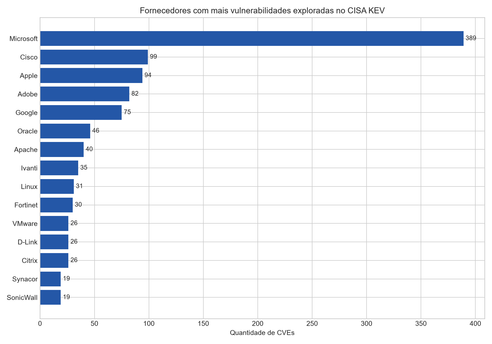
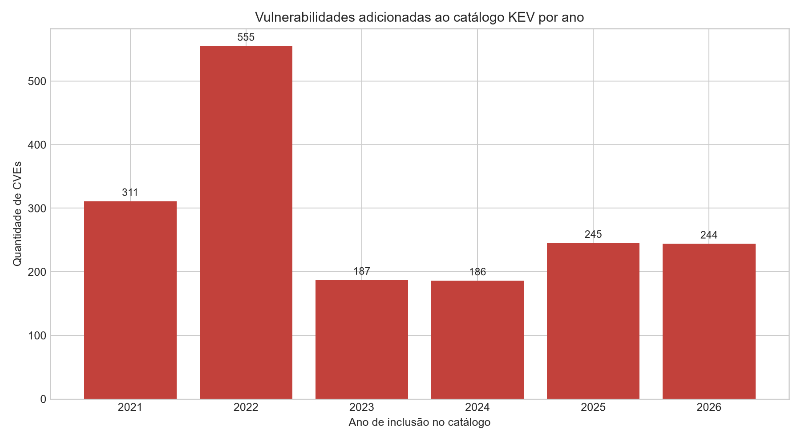
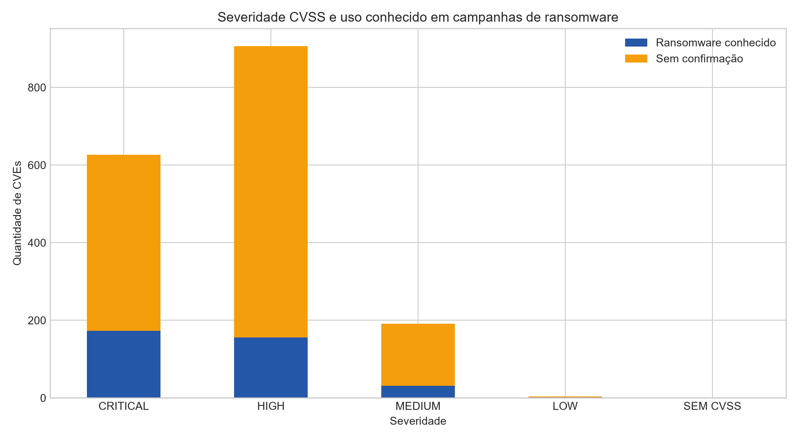

# MVP — Priorização de vulnerabilidades exploradas

**Autor:** Bruno Bryto Borges  
**Matrícula:** 231013304  
**Tema:** Segurança cibernética

## Resumo executivo

Este MVP implementa no Databricks um pipeline de dados para apoiar a priorização de vulnerabilidades realmente exploradas. A solução integra o catálogo **Known Exploited Vulnerabilities (KEV)** da CISA com os registros técnicos do **National Vulnerability Database (NVD)**, persiste as camadas Bronze, Silver e Gold em Delta Lake e produz um modelo estrela para análise.

Na versão 2026.09.27, as duas fontes possuíam os mesmos **1.728 CVEs**, todos integrados com sucesso. O conjunto cobre **283 fornecedores** e **726 pares fornecedor–produto**. O CVSS médio é **8,41**; 907 vulnerabilidades são classificadas como altas e 626 como críticas. A CISA confirma uso conhecido em ransomware para **361 CVEs (20,89%)**.

Principais conclusões:

- Microsoft concentra 389 CVEs do catálogo, seguida por Cisco (99), Apple (94), Adobe (82) e Google (75); a contagem reflete exposição e longevidade, não uma taxa de insegurança;
- Windows é o produto mais recorrente, com 172 CVEs, dos quais 48 têm uso conhecido em ransomware;
- as fraquezas mais frequentes são CWE-787 (164), CWE-78 (122) e CWE-416 (106);
- a mediana do intervalo não negativo entre publicação no NVD e inclusão no KEV é 443,5 dias, evidenciando que vulnerabilidades antigas continuam sendo exploradas;
- a janela mediana definida pela CISA para correção é de 21 dias;
- 110 CVEs (6,37%) não possuem CWE utilizável e 228 apresentam publicação formal no NVD posterior à inclusão operacional no KEV, limitações que impedem interpretar o intervalo como tempo de resposta em todos os casos.

## 1. Problema, hipótese e perguntas

Equipes de segurança frequentemente recebem milhares de alertas e não conseguem corrigir tudo simultaneamente. Priorizar somente pelo CVSS ignora evidência de exploração real e uso em ransomware.

**Hipótese:** combinar evidência operacional da CISA com severidade e fraquezas do NVD produz uma fila de priorização mais útil e auditável do que ordenar vulnerabilidades apenas por CVSS.

As perguntas foram definidas antes da coleta:

1. Quais fornecedores e produtos concentram mais vulnerabilidades comprovadamente exploradas?
2. Como as inclusões no KEV evoluíram no tempo e quanto tempo decorre entre publicação e entrada no catálogo?
3. Quais fraquezas CWE e níveis de severidade predominam?
4. Quais vulnerabilidades, fornecedores e fraquezas estão associados a uso conhecido em ransomware?
5. A completude, unicidade, consistência e conformidade das fontes permitem responder às perguntas com segurança?

## 2. Fontes, coleta, licença e ética

| Fonte | Uso | Endpoint |
|---|---|---|
| CISA KEV | exploração conhecida, fornecedor, produto, prazo, ransomware e ação requerida | [JSON oficial](https://www.cisa.gov/sites/default/files/feeds/known_exploited_vulnerabilities.json) |
| NVD CVE API 2.0 | publicação, estado, CVSS e CWE | [API oficial com `hasKev`](https://services.nvd.nist.gov/rest/json/cves/2.0?hasKev&resultsPerPage=2000) |

Coleta realizada em 28/09/2026. A CISA mantém o KEV como fonte autoritativa de vulnerabilidades exploradas e recomenda seu uso na priorização de gestão de vulnerabilidades. O NVD é mantido pelo NIST e enriquece CVEs com dados técnicos padronizados. Os dados governamentais permanecem atribuídos às fontes; o código e a documentação autoral usam licença MIT.

Não há dados pessoais, credenciais, telemetria interna ou informações de vítimas. O projeto utiliza apenas dados públicos sobre vulnerabilidades. As contagens por fornecedor não devem ser usadas isoladamente para rotular empresas ou produtos como “mais inseguros”, pois não há denominador de base instalada, quantidade de versões nem tempo de exposição.

## 3. Arquitetura

```text
CISA KEV JSON ──> Bronze CISA ──┐
                                ├──> Silver integrada ──> Gold/Delta ──> resultados e evidências
NVD CVE API ────> Bronze NVD ───┘
```

- **Bronze:** dados brutos, URL, versão e horário de ingestão;
- **Silver:** integração por CVE, tipos corrigidos, CVSS selecionado, CWE normalizado, indicadores e validação;
- **Gold:** modelo estrela, ponte CVE–CWE, qualidade e tabelas de resposta;
- **Persistência:** tabelas Delta com prefixo `tarefa_4_` no catálogo e esquema ativos do Databricks.

## 4. Modelagem

O modelo estrela contém:

- `tarefa_4_fato_vulnerabilidades`: uma linha por CVE explorado;
- `tarefa_4_dim_fornecedor`, `tarefa_4_dim_produto` e `tarefa_4_dim_tempo`;
- `tarefa_4_dim_cwe` e `tarefa_4_ponte_cve_cwe`, pois um CVE pode possuir mais de uma fraqueza;
- agregações Gold de fornecedores, evolução temporal, CWEs e ransomware.

O [catálogo de dados](catalogo/catalogo_dados.md) documenta grão, domínios, tipos, regras e linhagem. O [diagrama Mermaid](catalogo/modelo_estrela.mmd) registra as relações.

## 5. Transformações

1. baixar os JSONs diretamente das fontes oficiais;
2. explodir os arrays de vulnerabilidades e gravar as duas tabelas Bronze;
3. padronizar o CVE e integrar as fontes por `cve_id`;
4. selecionar a versão CVSS mais recente disponível: 4.0, 3.1, 3.0 ou 2.0;
5. consolidar CWE do NVD, usando a CISA como alternativa;
6. converter datas e derivar intervalo até o KEV, janela de correção, ano e mês;
7. marcar ransomware somente quando o valor CISA é `Known`;
8. validar formato do CVE, fornecedor, produto e data de inclusão;
9. remover duplicidades por CVE e persistir dimensões, fato, ponte e agregações.

As escritas usam `overwrite`, tornando a execução idempotente.

## 6. Qualidade dos dados

A auditoria completa está em [`evidencias/qualidade_por_atributo.csv`](evidencias/qualidade_por_atributo.csv).

| Dimensão | Resultado | Interpretação |
|---|---|---|
| Completude | CVE, fornecedor, produto, datas e CVSS sem nulos | atributos essenciais completos |
| Integração | 1.728 de 1.728 chaves presentes nas duas fontes | cobertura de 100% na coleta |
| Unicidade | zero CVEs duplicados em ambas as fontes | chave adequada para integração |
| CWE | 110 registros sem classificação utilizável | análises de fraqueza cobrem 93,63% |
| Conformidade | CVSS entre 2,7 e 10; 4 severidades; formato CVE validado | domínios coerentes |
| Consistência temporal | 228 intervalos negativos | publicação NVD não deve ser tratada sempre como início operacional |
| Atualidade | catálogo CISA 2026.09.27 | retrato reproduzível, porém a fonte é continuamente atualizada |

## 7. Resultados e discussão

### 7.1 Concentração por fornecedor e produto



Microsoft aparece com 389 CVEs e 117 casos conhecidos de ransomware. Em seguida vêm Cisco (99), Apple (94), Adobe (82) e Google (75). Entre produtos, Windows soma 172 CVEs, Multiple Products da Apple 53, Chromium V8 41, Internet Explorer 36 e Flash Player 33. Esses números ajudam a dimensionar filas de correção em ambientes que usam essas tecnologias, mas não permitem comparar segurança intrínseca sem um denominador.

### 7.2 Evolução temporal e urgência



O pico de 555 inclusões em 2022 inclui consolidação inicial do catálogo. Depois de 187 em 2023 e 186 em 2024, foram 245 em 2025 e 244 até 27/09/2026. A mediana não negativa de 443,5 dias entre publicação e inclusão mostra que vulnerabilidades antigas podem ganhar nova urgência quando surge evidência de exploração. A mediana da janela de correção é 21 dias; 1.025 CVEs receberam exatamente esse prazo.

### 7.3 Severidade e ransomware



Há 907 CVEs de severidade alta, 626 críticos, 191 médios e 4 baixos. Dos 361 associados a ransomware, Microsoft responde por 117, seguida por Fortinet (14), Oracle (13), SonicWall (13) e Ivanti (12). A presença de CVEs médios e até baixos no KEV reforça que evidência de exploração deve complementar o CVSS.

### 7.4 Fraquezas recorrentes

As maiores categorias são CWE-787, escrita fora dos limites (164); CWE-78, injeção de comando no sistema operacional (122); CWE-416, uso após liberação de memória (106); CWE-20, validação imprópria de entrada (97); e CWE-22, travessia de caminho (96). Para ransomware, CWE-22 aparece em 38 CVEs, CWE-502 em 30 e CWE-787 em 29. Isso orienta práticas de desenvolvimento seguro e testes direcionados.

### 7.5 Síntese decisória

A hipótese foi confirmada. CVSS ajuda a ordenar impacto potencial, mas a priorização deve elevar CVEs com exploração confirmada, ransomware conhecido, prazo curto e presença efetiva no inventário da organização. O MVP não possui inventário de ativos; portanto, produz uma base de inteligência e não uma fila final específica para uma empresa.

## 8. Reprodução

### Databricks

1. importe [`notebooks/01_pipeline_ciberseguranca.py`](notebooks/01_pipeline_ciberseguranca.py);
2. conecte a um ambiente Serverless ou cluster com Spark e Delta Lake;
3. execute todas as células;
4. confira as tabelas `tarefa_4_*` e a saída final de persistência.

O notebook baixa as fontes automaticamente. Não é necessário enviar os JSONs manualmente.

### Validação local opcional

Baixe os dois endpoints para `data/raw/cisa_kev.json` e `data/raw/nvd_kev.json`, instale as dependências e execute:

```bash
python scripts/analise_local.py
```

## 9. Evidências e resultados

O diretório [`evidencias/`](evidencias/) contém três gráficos e a auditoria por atributo. O diretório [`resultados/`](resultados/) contém o conjunto integrado, agregações auditáveis e a lista de vulnerabilidades ligadas a ransomware. O notebook termina relendo todas as tabelas Delta para comprovar persistência.

## 10. Autoavaliação

As cinco perguntas foram respondidas e a integração apresentou cobertura total. A maior dificuldade foi harmonizar estruturas JSON aninhadas e versões distintas do CVSS. A limitação mais importante é a ausência do inventário de ativos: um CVE crítico em produto não utilizado não deve superar uma vulnerabilidade explorada presente em ativo exposto. Se o projeto fosse reiniciado, seriam incluídos CPEs instalados, criticidade do ativo, exposição à internet, EPSS e estado real da correção. Para produção, também seriam necessários execução diária, tratamento de paginação acima de 2.000 registros, testes de esquema, alertas e histórico incremental em vez de apenas retrato corrente.

## 11. Estrutura

```text
.
|-- README.md
|-- LICENSE
|-- catalogo/
|   |-- catalogo_dados.md
|   `-- modelo_estrela.mmd
|-- evidencias/
|   |-- README.md
|   |-- evolucao_anual_kev.png
|   |-- qualidade_por_atributo.csv
|   |-- severidade_ransomware.png
|   `-- top_fornecedores.png
|-- notebooks/
|   `-- 01_pipeline_ciberseguranca.py
|-- resultados/
|   |-- evolucao_temporal.csv
|   |-- fornecedores.csv
|   |-- fraquezas_cwe.csv
|   |-- produtos.csv
|   |-- resumo.json
|   |-- vulnerabilidades_enriquecidas.csv
|   `-- vulnerabilidades_ransomware.csv
|-- scripts/
|   `-- analise_local.py
`-- requirements.txt
```

## Referências

- [CISA — Known Exploited Vulnerabilities Catalog](https://www.cisa.gov/known-exploited-vulnerabilities-catalog)
- [CISA — Binding Operational Directive 22-01](https://www.cisa.gov/news-events/directives/bod-22-01-reducing-significant-risk-known-exploited-vulnerabilities)
- [NVD — Vulnerabilities API](https://nvd.nist.gov/developers/vulnerabilities)
- [FIRST — Common Vulnerability Scoring System](https://www.first.org/cvss/)
- [MITRE — Common Weakness Enumeration](https://cwe.mitre.org/)
