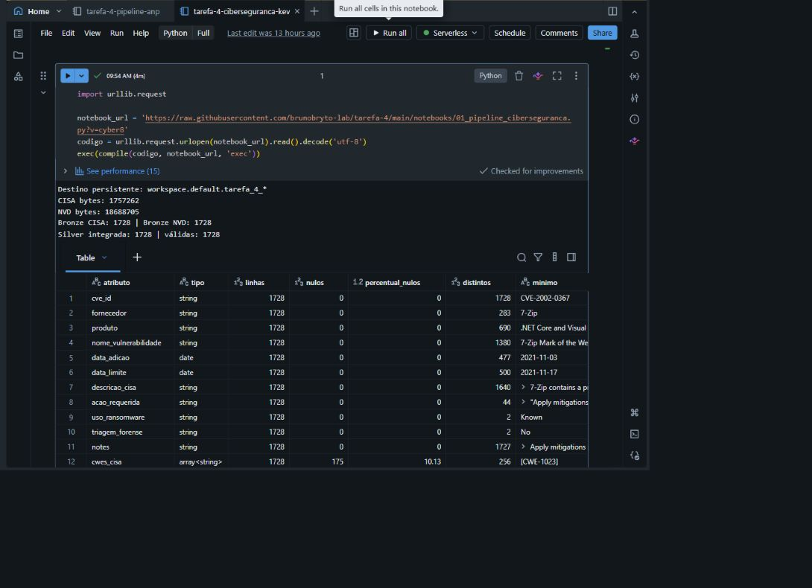
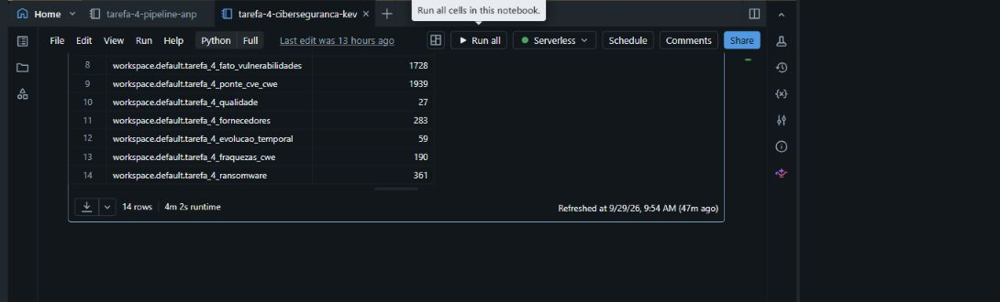

# Evidência de execução no Databricks

- **Notebook:** `tarefa-4-ciberseguranca-kev`
- **Ambiente:** Databricks Free Edition, computação Serverless
- **Catálogo e esquema:** `workspace.default`
- **Data da execução:** 29/09/2026
- **Tempo exibido:** 4 min 02 s
- **Resultado:** célula concluída com sucesso; 1.728 registros CISA, 1.728 registros NVD, 1.728 integrados e 1.728 válidos.
- **Validação da auditoria:** intervalo CVSS de 2,7 a 10,0 e listas CWE vazias contabilizadas como ausência (`cwes_cisa`: 175; `cwes_nvd`: 203).

O bloco final releu cada tabela do catálogo depois da gravação e apresentou estas contagens:

| Tabela Delta | Linhas persistidas |
|---|---:|
| `tarefa_4_bronze_cisa_kev` | 1.728 |
| `tarefa_4_bronze_nvd_kev` | 1.728 |
| `tarefa_4_silver_vulnerabilidades` | 1.728 |
| `tarefa_4_dim_fornecedor` | 283 |
| `tarefa_4_dim_produto` | 719 |
| `tarefa_4_dim_tempo` | 477 |
| `tarefa_4_dim_cwe` | 190 |
| `tarefa_4_fato_vulnerabilidades` | 1.728 |
| `tarefa_4_ponte_cve_cwe` | 1.939 |
| `tarefa_4_qualidade` | 27 |
| `tarefa_4_fornecedores` | 283 |
| `tarefa_4_evolucao_temporal` | 59 |
| `tarefa_4_fraquezas_cwe` | 190 |
| `tarefa_4_ransomware` | 361 |

As tabelas antigas do tema ANP foram removidas no início do pipeline. O código usa `overwrite` com esquema atualizado nas camadas reconstruídas, de modo que novas execuções sejam idempotentes.
